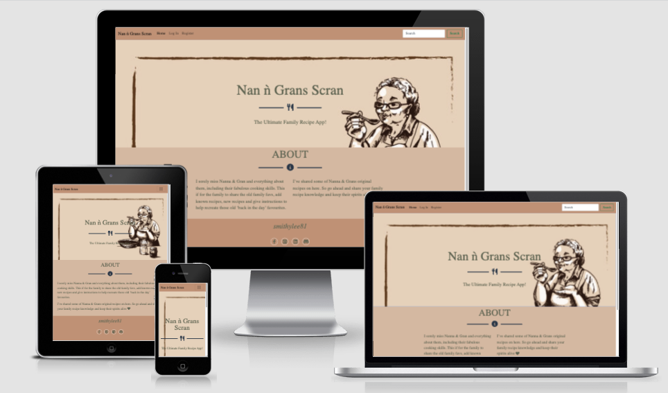
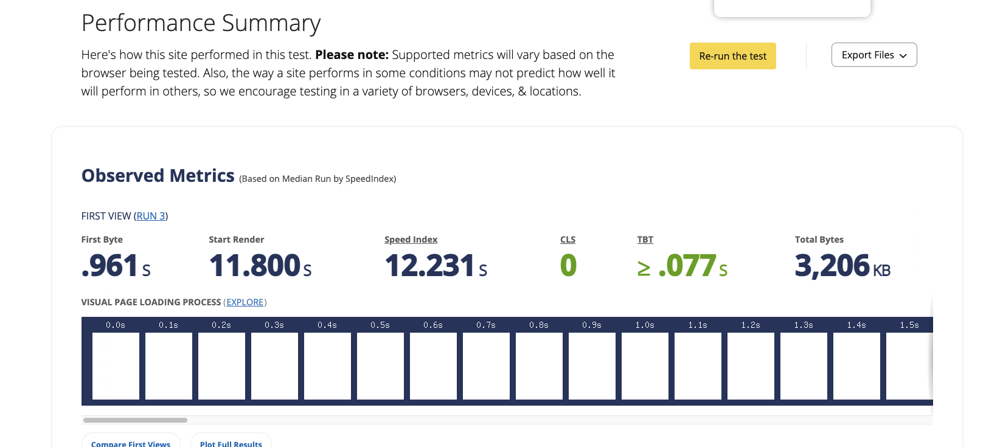

<h1 align="center">Nan & Grans Scran</h1>

<h2 align="center"></h2>

## About

A Homemade Recipe website designed for the purposes of the family to visit, see other family members recipes, search recipes and create new recipes sharing their own knowledge of the family’s history of ‘gid auld hame cookin’. The website is designed to be responsive and accessible on a wide range of devices, making it easy for everyone to access and use whether they're on the go or sitting at a desktop.

I created the site to look vintage and homely using an earthy colour scheme, with varied colours of brown and cream, to bring a warm and comforting feel, in keeping with a family orientated & vintage theme.  

[View the live project here.](https://nan-n-grans-scran.herokuapp.com/)

## **Contents**

- [**UX (User Experience)**](#ux-user-experience)
  - [**User Stories**](#user-stories)
  - [**Site Owner Goals**](#site-owner-goals)
- [**Design Choices**](#design-choices)
  - [**Fonts**](#fonts)
  - [**Colours**](#colours)
  - [**Imagery**](#imagery)
  - [**Wireframes**](#wireframes)
- [**Technologies**](#technologies)
  - [**Languages**](#languages)
  - [**Libraries**](#libraries)
  - [**Tools**](#tools)
- [**Features**](#features)
  - [**Features Implemented**](#features-implemented)
  - [**Future Features**](#future-features)
  - [**Responsive Design**](#responsive-design)
- [**Version Control**](#version-control)
- [**Testing**](#testing)
  - [**Functionality Testing**](#functionality-testing)
  - [**User Story Testing**](#user-story-testing)
  - [**Performance Testing**](#performance-testing)
  - [**Responsive**](#responsive)
- [**Deployment**](#deployment)
- [**Credits**](#credits)
  - [**Code**](#code)
  - [**Content**](#content)
  - [**Layout**](#layout)
  - [**Acknowledgements**](#acknowledgements)
  

## **UX (User Experience)**


### **User Stories**
- As a family member/user visiting the site for the first time:
  - I want to be able to see social media links so that I can keep in contact with the site owner through Facebook, LinkedIn, GitHub and Discord (for the IT geeks of the family).
  - I want to click navigation links to be taken to the correct section and back to the home page for a good user experience.
  - I want the page to be simple in its layout so that I can navigate it easily.  
  - I want to easily understand the main purpose of the site and navigate with ease to read other family members recipes, create my own recipe cards and update and/or delete where necessary.

- As a user returning to the site:
  - I want to be able to access the site easily on my chosen device
  - I want to easily be able to navigate to different parts of the site
  - I want to be able to create more recipes or read any new recipes that have been added.

### **Site Owner Goals** 
- As a site owner I want the family/users to be able to access our Nanna & Grandmother’s homemade recipes.
- As a site owner I want the family/users to be able to register to create their own profile and add their own family recipes to the site for other family members to view.
- As a site owner I want the family/users to enjoy viewing others recipes and gain a sense of nostalgia.
- As a site owner I want to create a website with a great user experience so that family members will enjoy using the app again and again and keeping the family history alive. 

[Back to contents](#contents)


## **Design Choices**

### **Fonts**

I wanted to create a vintage look and therfore utilised the 'Vintage Party' from 'CDN Fonts' ['http://fonts.cdnfonts.com/css/vintage-party'], with 'sans-serif' as a back-up font;

### **Colours**

As the site purpose is about keeping the family history alive the colour scheme used is adapted to suit a vintage and nurturing feel. “In branding and marketing, brown is associated with reliability, dependability, and nurturing. Popular brands that use brown in their logos and marketing include UPS, Hershey's, Cotton, Edy's, J.P. Morgan, and M&Ms.” ( ‘verywellmind’) [https://www.verywellmind.com/the-color-psychology-of-brown]


It features complementary greys and browns that stand out to make the content easy to read. 

The colours chosen are:


Format: [Coolors Palette]( https://coolors.co/palette/cb997e-ddbea9-ffe8d6-b7b7a4-a5a58d-6b705c)

These colours complement each other well and are not too striking, in keeping with what the user expects from the vintage feel. 


### **Imagery**

Images feature vintage & retro pictures to keep the theme, with main background image on home page of a Grandmother tasting a recipe and relevant images of food courses throughout the website.  

Images have been sourced from a variety of sites with free use:

1. [Free PNGs]( https://www.freepngs.com) 
2. [Stock Adobe] (https://stock.adobe.com/hu/search/images?k=grandma+cooking+vintage); (https://t3.ftcdn.net/jpg/04/16/23/16/360_F_416231629_f3tTvaDgVMeXbn7GFmilwGLhiWPekXTG.jpg)
3. [Unsplash] (https://images.unsplash.com/photo-1603105037880-880cd4edfb0d?ixlib=rb-1.2.1&ixid=MnwxMjA3fDB8MHxzZWFyY2h8M3x8c291cHxlbnwwfHwwfHw%3D&auto=format&fit=crop&w=500&q=60)
4. [Scotsman] (https://www.scotsman.com/images-e.jpimedia.uk/imagefetch/http://www.scotsman.com/webimage/Prestige.Item.1.62467723!image/image.jpg?width=2048&enable=upscale)
5. [The Hidden Veggies](https://thehiddenveggies.com/wp-content/uploads/2019/11/vegan-pate-mushroom-2.jpg)
6. [Scottish Scran] (https://sp-ao.shortpixel.ai/client/to_webp,q_glossy,ret_img,w_1024/https://scottishscran.com/wp-content/uploads/2021/03/Haggis-Bon-Bons-Recipe-73-1024x683.jpg)
7. [The View From Great Island](https://theviewfromgreatisland.com/wp-content/uploads/2018/04/rhubarb-crisp-2447-April-07-2018.jpg)
8. [Clipart] (https://us.123rf.com/450wm/squarelogo/squarelogo1207/squarelogo120700055/14651230-vintage-top-secret-recipe.jpg?ver=6) , (https://previews.123rf.com/images/studiostoks/studiostoks1508/studiostoks150800070/44238328-ideen-kochbuch-hausrezept-lebensmittel-kochen-tutorial-frau-pop-art-retro-stil.jpg)
9. [EbayImg](https://i.ebayimg.com/images/g/BIEAAOSwakJcJ3tN/s-l300.jpg)


The types of images chosen showcase the themes for each recipe category and hopefully provide the user with a vintage & retro type feel and an intuitive experience. 


### **Wireframes**

Wireframes were hand drawn and can be found in pdf form in [wireframes](static/assets/wireframes)

- [Home Page - Desktop](static/assets/wireframes/Home-Page-Wireframe-2.jpg)
- [Mobile & Tablet View - Home](static/assets/wireframes/mobile-index.png)


[Back to contents](#contents)


## **Technologies**


### **Languages**

- [HTML5](https://developer.mozilla.org/en-US/docs/Web/HTML)
  - Used as the main markup language for the website content.
- [CSS3](https://developer.mozilla.org/en-US/docs/Web/CSS)
  - Used to style the individual webpages.
- [Python](https://developer.mozilla.org/en-US/docs/Glossary/jQuery) 
- [JavaScript]( https://developer.mozilla.org/en-US/docs/Web/JavaScript)
 - Sourced from the Startbootstrap theme ‘Freelancer’
- [Jinja Template Engine]( https://codeburst.io/jinja-2-explained-in-5-minutes-88548486834e)
 - Used for template inheritance and if/else conditions
- [Flask]( https://www.digitalocean.com/community/tutorials/how-to-make-a-web-application-using-flask-in-python-3)
  - Used for flexibility and an accessible framework for quicker build times.
  


### **Libraries**

- [Bootstrap](https://getbootstrap.com/)
  - Used to design a mobile-first responsive website layout along with custom components (Registration form and Input fields & cards).
-[Startbootstrap](https://startbootstrap.com/theme/freelancer)
 - ‘Freelancer’ theme used for the basic layout of the site and to help reduce build time. This included the Navigation Bar, Menu Dropdown- for mobile, Footer, About section and ‘Masthead’ section for use of the background Image.
  
### **Tools**

- [Git](https://git-scm.com/)
  - Git was used for version control (commit to Git and push to GitHub).
- [GitHub](https://github.com/)
  - Used to store, host and deploy the project files and source code after being pushed from Git. 
- [Gitpod](https://www.gitpod.io/)
  - An online IDE linked to the GitHub repository used to write my code.
- [Font-Awesome](https://fontawesome.com/icons/utensils?s=solid)
  - Used for food & utensil icons.
- [Google fonts](https://fonts.google.com/)
  - Used to compare and choose fonts. 
- [Coolors](https://coolors.co/)
  - Used to choose the colour scheme by comparing and contrasting similar colours in the generator.
- [Lighthouse](https://developers.google.com/web/tools/lighthouse)
  - Used to audit the site for quality and ensure responsiveness.
- [WebPageTest](https://www.webpagetest.org/)
  - Used to test performance.
- [amiresponsive](http://ami.responsivedesign.is/)
  - An online tool to check how responsive the site is on different devices.
- [W3C CSS Validation Service]( https://jigsaw.w3.org/css-validator/#validate_by_input)
  - Used to validate the CSS
- [W3C Markup Validation Service]( https://validator.w3.org/#validate_by_input)
  - Used to validate the HTML
- [Heroku]( https://dashboard.heroku.com/apps)
  - Used to launch the live website
- [MongoDB]( https://www.mongodb.com/)
  - Used to create the recipe database and store all required information such as recipe titles, ingredients, cooking times etc. 

[Back to contents](#contents)

## **Features**

### **Features Implemented**

Features relevant to all pages:
- **base.html - Header & Footer**
    - Contains navigation links and is fixed to the top of the page for easy use on all devices (this was done using a Bootstrap 5 NavBar). 
    - Both the Home link and Title Logo provide navigation back to the Home page for ease of use and return to the main home page.
    - Navigation links collapse into a hamburger menu button on mobile and tablet view for an easy user experience. 
    - The colour scheme is designed to be vintage and easy to read with the contrast tested on Google Dev Tools to preview.

- **Footer** 
    - Designed to sit at the bottom of the page after all of the content 
    - Contains social media links to the Developer’s GitHub repository and links to Facebook, Discord and LinkedIn. 


- **Register Form**
    - For the user to register their name & email address to provide Log In details and their own profile/account. Fields: Name, Email and Password are required and display an error message if not filled in when selecting submit. 


    ### **Future Features**
- I would like to add a section where the family can view the handwritten recipe pages that Nanna & Gran wrote personally, time constraints impacted this.
- I would also like to add an option for an alert to other users when a new recipe has been added so that they can go onto the app and view this is they wish. 
- I would have liked to have successfully created a python function and appropriate syntax to enable the upload of an image by the user before final deployment and submission, however my attempts were unsuccessful to date.
- I would have liked to have utilised the 'created_by' section with a feature to allow edit and delete of the users own created recipes ONLY, time constraints impacted on same.
- I would also like to utilise the 'search' bar in future development for users to find what they are looking for quicker and easier. The search fields are present on NavBar but have not been 'wired up' to the app.py with an appropriate function as yet.
- I would like the Profile page to be built out more with facility to upload an image to this section for a more personalised user feel.
- I would also like to utilise a 'star ratings' feature for the family to rate the recipes.
- I would also like a 'favorites' selection to be implemented and enabled which displays on the users profile. 


[Back to contents](#contents)

### **Responsive Design**

- Bootstrap & Startbootstrap were used to make the site responsive on all devices.

[Back to contents](#contents)


## **Version Control**

**Version control** managed within **GitHub** & **Gitpod** with regular commits pushed to **GitHub**:

[Back to contents](#contents)


---

## **Testing**

Testing documentation, processes, and outcomes can be found under [TESTING.md](TESTING.md).

---

### **Performance Testing**

WebPageTest utilised: [https://app.webpagetest.org/]




### **Responsive**
The site is responsive on all browsers and mobile through the Startbootstrap framework and media queries and was tested using [Chrome Dev Tools](https://developer.chrome.com/docs/devtools/). 

The live site address was given to family and friends to confirm the links work as expected and is responsive on all devices. 

[Back to contents](#contents)


## **Deployment**

## How this project was Developed and Deployed

The project was developed using [GitPod](https://gitpod.io/), pushed to [GitHub](https://github.com/) and deployed to Heroku via the following steps:


### Initial Deployment

- Navigate to [Heroku](https://www.heroku.com/).
- [Log in](https://id.heroku.com/login) or [Sign Up](https://signup.heroku.com/) for an account.
  - If Creating an account, select **Python** as the Primary development language.
  - Activate the account via the confirmation email.
  - Accept the Terms of Service.
- Click on **Create new app**.
- Enter a suitable **App Name** and **Region**.
- Click **Create App**.
- Under the **Deploy** tab, under the heading **Deployment Method**, click the **GitHub** icon, and proceed to click the button which states **Connect to GitHub**.
- Enter your credentials for **GitHub.**
- Search for the repository required (in this instance, **Nan n Gran's Scran**), and click **Connect.**

### Automatic Deployment

This project was set up to automatically re-deploy with any changes made to the Master Branch. The following steps were taken to enable this.

- Navigate to the **Automatic deploys** section within the **Deploy** tab.
- Select the **branch** you would like to link to automatic deployment.
  - As stated above, the `main` branch was chosen for automatic deployment.
- Click **Enable Automatic Deploys**.

### Environment Variables

The following environment variables must be set within your Heroku Server for the site to deploy and function correctly. Navigate to the **Settings** tab, and under the heading **Config Vars**, select **Reveal Config Vars,** and add the following variables:

- **IP** : 0.0.0.0
- **PORT** : 5000
- **MONGO_URI**
  - This variable can be obtained from **MongoDB** through the following steps:
  - Log in to [MongoDB](https://www.mongodb.com/2).
  - Under **Data Storage** click on **Clusters**.
  - For the Cluster that you would like to connect to, click the **Connect** button.
  - Click on **Connect your Application.**
  - Select **Python**, and Version **3.6 or Later.**
  - Copy the connection string, replacing `<password>` with your MongoDB password, and `myFirstDatabase` with the name of the **MongoDB Collection** (Database) you would like to connect to.
- **MONGO_DBNAME**
  - The name of the Database you are connecting to (in the above example, the default would be `myFirstDatabase`.
- **SECRET_KEY**
  - A random sequence of characters, required for maintaining session security in Flask. One method of obtaining a Secret Key is through [RandomKeygen](https://randomkeygen.com/).


### Environment Variables

- When running this project locally, the **Environment Variables** must be set in order for it to function as intended.
- Once you have completed any of the upcoming steps to run/deploy the project in your browser or locally, please create a new python file in your root directory called [**envy.py**](https://pypi.org/project/env.py/).
- Within this file, declare the environment variables described above, in the following format, replacing the `<variable>` with the required variables:

```python
import os
os.environ.setdefault("IP", "<variable>")
os.environ.setdefault("PORT", "<variable>")
os.environ.setdefault("SECRET_KEY", "<variable>")
os.environ.setdefault("MONGO_URI", "<variable>")
os.environ.setdefault("MONGO_DBNAME", "<variable>")
os.environ.setdefault("GMAPS_API", "<variable>")
os.environ.setdefault("GMAPS_ID", "<variable> ")
```

The project will automatically locate this file, and read the required environment variables as and when necessary. This file has not been included within the repo due to the security implications.


### How to run the project locally

To clone this project from GitHub follow the instructions taken from [GitHub Docs](https://docs.github.com/en/github/creating-cloning-and-archiving-repositories/cloning-a-repository):
1. Navigate to the [GitHub Repository](https://github.com/smithylee81/NanNGransScran)
2. Above the files click the green Download Code link.
3. To clone using HTTPS click the clipboard symbol under "Clone with HTTPS". To clone using SSH key click Use SSH then click the clipboard symbol. To clone using GitHub CLI select Use GitHub CLI and click the clipboard symbol. 
4. Open Git Bash
5. Change the working directory to the location you want the cloned directory to be.
6. Type 'git clone' and paste the url copied from step 3. 
7. Press 'enter' to create your clone.

[Back to contents](#contents)


## **Credits**

### **Code**

- Code Institute (CI) Full Stack Developer Course, 
- CI Flask Task Manager Mini project and Thorin & Company project
- Startbootstrap for initial Website Template
- Ben Kavanagh Git Hub Repository via my Mentor (Ronan) recommendations on creating a seperate TESTING.md file (https://github.com/BAK2K3)
- Bootstrap Version 5.1 (https://getbootstrap.com/docs/5.1/getting-started/introduction/)

### **Content**

- README.md & TESTING.md help came from: 
  -[Code Institute](https://github.com/Code-Institute-Solutions/SampleREADME)
  -CI Mentor – Ronan McClelland, thank you for your continued support, guidance, constructive feedback and encouragement. 
  
### **Layout**

- Code Institute tutorials using Startbootstrap Theme, some themes from this later disregarded as not required. 


### **Acknowledgements**

- My CI Mentors Ronan McClelland and Spencer Barriball for the continued support, encouragement and helpful advice and feedback.
- My family and friends for testing the site and giving feedback.

[Back to contents](#contents)
