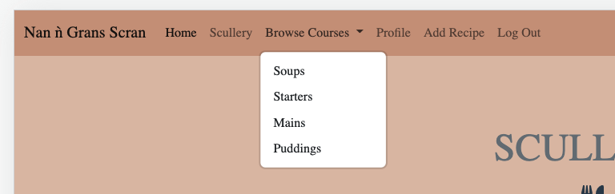

# Nan n Gran's Scran - Testing Documentation

The Main README documentation can be found under [README.md](README.md)

## **Contents**

> 1.  [User Story Testing](#user-story-testing)
> 2.  [Home Page Testing](#home-page-testing)
> 3.  [Footer Testing](#footer-testing)
> 4.  [Register Testing](#register-testing)
> 5.  [Log In Testing](#log-in-testing)
> 6.  [Navigation Bar Testing](#navigation-bar-testing)
> 7.  [Log Out Testing](#log-out-testing)
> 8.  [Scullery Testing](#scullery-testing)
> 9.  [Browse Courses Testing](#browse-courses-testing)
> 10.  [Add New Recipe Testing](#add-new-recipe-testing)
> 11.  [Edit Recipe Testing](#edit-recipe-testing)
> 12.  [Delete Recipe Testing](#delete-recipe-testing)
> 13.  [Code Validation](#code-validation)
> 14.  [Significant Bugs](#significant-bugs)
> 15.  [Browser Testing](#browser-testing)

# User Story Testing

## As a family visitor to the website, I want to know what I can do on the website, navigate with ease using a clearly defined navigation bar, understand how to register an account and be able to see social media links to be able to contact & communicate with the developer (a family member).

**Acceptance Criteria:** Users must be able to understand the websites purpose on first visit and easily see where to register.

**Summary:**

- When the user visits the website, they are presented with a **Logo & Hero Image** containing a self-descriptive name and vintage image of an elderly lady holding a spoon.
- The **NavBar** is positioned at the top of the page, and is therefore familiar and easy to identify.
- When a user first visits the website, they are presented with a title and short description, an 'About section' which provides them with an understanding of the reason for the development of the site and awareness that they can also share their recipes on the site.
- The **NavBar** provides a clear indication of the next steps.
- The **Footer** provides social media icons as buttons to select. These open in a new page leaving the original URL available for the user to navigate back with ease/not lose the home page.
- It is therefore clear, from first visit, the name and purpose of the website.

**Outcome: Pass**

## As a user, I want the page to have an intuitive layout, so that I can interact with the site with ease without any dubiety of where to go next.

**Acceptance Criteria**: A user should be able to understand how to both navigate and interact with the website and its features, either through design, implementation or through instructions.

**Summary:**

- When the user clicks register, they are presented with a seperate **Register** page containing a self-explanatory form to complete **Username** and **Password** with a simple **Register Button** to complete their registration. 
- Should the user have forgotten they have already registered there's an available option provided at the bottom of the form **Already Registered?** & a **Log In** link for ease of use.
- The form fields have been made a 'requirement' therefore failing to complete each field provides feedback to the user that they must complete that field before they can select 'Register' keeping them on the right tracks. 
- Once registered the page automatically provides confirmation of this by a 'flash message' at the top of the page and displays a **Profile** page for the user.
- The Profile page also provides a link via a button which states 'Go to Scullery' which then takes the user to the Scullery to explore the recipes.
- Within the **Scullery** the user is able to select the type of dining **Course** they wish with a simple 'View' button taking them to the available recipes in that **Category**.
- Once the user has selected their choice of Course they can then see recipes and opt to view each individual recipe, with a button link to take them 'back to scullery'
- Once registered/logged in the user has more options on the NavBar including the **Scullery**, **Browse Courses** (taking them to the individual pages as an alternative to the visual Scullery page), go to their own **Profile**, **Add Recipe** and **Log Out**
- Within each recipe their is options to **Edit** or **Delete** the recipe or navigate back to the **Scullery** keeping it simple to use.
- Within the **Edit** and **Delete** pages these provide clear and self-explanatory forms which include **Placeholders** to keep the user on the right path, each field remains a requirement and therfore ensures each field has been provided wiht detail before it saves either the changes or saves the new recipe created. 
- The **Edit**, **Delete** and **Add Recipe** options, when complete, flash a message to the user to confirm they have either Edited, Deleted or Added a recipe.
- Considering all of the above, it is clear that there is an intuitive layout which is se;f-explanatory to the user with some hints, instructions and flash messages along the way to keep them on the right track.

**Outcome: Pass**

[Back to contents](#contents)

# Home Page Testing

- The Home page displays the intial options on the **NavBar** for a non-registered/not logged in user, as this has been created for the purposes of the developers family to use privately, the member has to create an account before they can log in and use the site: 

# Footer Testing

- The footer bar clearly shows the social media icons with links taking to seperate pages:

- Each link was tested and work well opeining in a new page on the users browser.

# Register Testing

- The username & password fields are a requirement and was tested to ensure the user completes this and is unable to register without these, preventing a file saving with empty details on the database. It also provides the option at the bottom of the form to **Log In** if they are 'already registered?'.

- Upon registering the user is advised this was successful and automatically displays a profile page with option to 'go to Scullery':

- Database Test **(MongoDB)**: When a user successfully registers, a document is successfully written to the 'Users' collection in the Database, in the following format:
_id: Unique object ID generated by MongoDB
Username: A lowercase version of the username provided by the user.
Password: A hashed version of the password provided by the user.

[Back to contents](#contents)

# Log In Testing

- As with the Register function, the username & password fields are a requirement and these were tested to ensure the user has to complete this, they are unable to log in without the required details and this prevents saving a file with empty details on the database. It also provides the option at the bottom of the form to **Register** if they are 'new here'.

- Once logged in, the user recieves a welcome message and displays their profile page and option to go to the Scullery, which works well:

# Navigation Bar Testing

- Each option on the NavBar was selected and the user is taken to the desired routes succesfully.

- For the same experience on a mobile view, the page NavBar is responsive **(Bootstrap 5)** and changes to a **Hamburger Icon** for dropdown menu, with all links continuing to work and take the user to their desired area on the site:

# Log Out Testing

- The user is given a message to confirm they have been logged out following selecting the **Log Out** option and returns them to the **Log In** page:

# Scullery Testing

- The user is taken to a visual display of options to choose which course recipes they wish to view:

[Back to contents](#contents)

# Browse Courses Testing

- The **Browse Courses** option on the NavBar also provides the available categories as an alternative to going to the **Scullery** page:

# Add New Recipe Testing

- Adding a recipe is accessed with ease via the **Add Recipe** option on the NavBar and displays a new add recipe form for the user to complete with clear instruction 'add your recipe here!'. All fields are required fields, including placeholders to keep the user right, and there is an option to upload an image of their recipe (*NOTE: Please see the significant bugs section regarding the upload image function*)
- A cancel button is also availble if the user changes their mind and is redirected back to the Scullery section.
- Once the **Add to Scullery** option has been selected the form confirms to the user by **Flash Message** that this has been successful: 

# Edit Recipe Testing

- After completing the edit recipe form and clicking 'edit recipe' a flash message is returned to the user confirming the edit success: 

# Delete Recipe Testing

- The option to delete a recipe is on all cards (*NOTE: Please see the 'Nice to Have' section in the README.md file on this option only being available to the users who created the recipe- impacted on due to time constraints*)

[Back to contents](#contents)

## Responsive Layout and Design

The features detailed above were re-tested for use on all viewports, including the user interface for responsive layout and design.

### Browser Testing

Using Chrome Development tools, either via the pre-set mobile device resolutions or via the manual responsive tool (using `Google Lighthouse Inspection Tool`), the following was completed:

- Manual responsive testing via Chrome Development Tools, selecting `Inspect`.
- Cycling through each available device, and performing the tests as detailed above:
  - iPhone SE
  - iPhone 12 Pro
  - iPhone XR
  - Pixel 5
  - Samsung Galaxy S8+
  - Samsung Galaxy S20 ULtra
  - iPad Air
  - iPad Mini
  - Surface Pro 7
  - Surface Duo
  - Galaxy Fold
  - Samsung Galaxy A51/71
  - Nest Hub
  - Nest Hub Max
- Ensure all Features function and appear correctly from at least 320px wide.
- Ensure Cards and Modals **(Bootstrap 5)** are presented appropriately on all viewports:
  - Interaction is enabled.
  - The Modal fits on device's screen.
  - The content is legible.
  - The user can dismiss the modal.
  - The user can select all available options.

### Mobile and Tablet Testing

The website was physically tested on an iPhone 11, and an iPad. The following tests were completed:

- Ensure all interactive **icons** are distinguishable, identifiable, and are correctly sized and placed to allow users to interact with each of them via touchscreen individually.
- Ensure all inputs within data entry fields and forms respond appropriately to touchscreen devices.
- Ensure all text input fields respond appropriately to on-screen keyboards.
- Ensure the **Dropdown Nav** can be selected to collapse or reveal.

[Back to contents](#contents)

## Additional Testing

## Basic Routing

Test 1: **get requests**

- **Overview** : Test the response from a **get** request to the appropriate`/` URL *('/soups', '/starters' etc)*.
- **Expected Result** : 200 response code, appropriate templates returned.
- **Outcome** : Pass

Test 2 **: post requests**

- **Overview** : Test the response from a **post** request to the appropriate `/` URL *('/new_recipe', '/edit_recipe' etc)*
- **Expected Result** : 200 response code, and appropriate templates returned.
- **Outcome** : Pass

[Back to contents](#contents)

## Database CRUD

Test 1: **test registration**

- **Overview** : Submit a **post** request to `/register`, and check a user has been added to the **users** collection within MongoDB.
- **Expected Result** : User added to the database, and username verified against that provided during the Post request for registration.
- **Outcome** : Pass

Test 2: **test new recipe creation**

- **Overview** : Submit a **post** request to `/new _recipe`, and check a new recipe has been added to the **recipes** collection within MongoDB.
- **Expected Result** : A new recipe is successfully written to the database, and subsequently retrieved from the database for verification.
- **Outcome** : Pass

Test 3: **test update/edit recipe**

- **Overview** : Submit a **post** request to `/edit_recipe`, and verify the details on MongoDB for full contents and ID comparison.
- **Expected Result** : Recipe is successfully edited and updated within the database.
- **Outcome** : Pass

Test 4: **test delete recipe**

- **Overview** : Delete a recipe on the website, this is deleted from the Database collection 'recipes'.
- **Expected Result** : Recipe is successfully deleted from website and database respectively.
- **Outcome** : Pass

## Chrome/Firefox/Edge/Safari (iOS)

All functionality worked as intended.

[Back to contents](#contents)

# Code Validation

## HTML

- The project's HTML was validated using the automated [W3 Markup Validator](https://validator.w3.org/) at intervals throughout the development process.
- All HTML files were assessed:
  - base.html
  - edit_recipe.html
  - home.html
  - login.html
  - mains.html
  - new_recipe.html
  - profile.html
  - puddings.html
  - register.html
  - scullery.html
  - soups.html
  - starters.html
  - view_recipe.html

### Errors:
- 'Error: Bad value' highlighted in most pages due to the presence of the Jinja templating {} syntax.
- 'Error: No space between attributes': Same fixed.
- 'Error: The value of the for attribute of the label element must be the ID of a non-hidden form control': Same fixed; spelling error on the word summary (written as 'summmary').
- 'Error: Non-space characters found without seeing a doctype first. Expected <!DOCTYPE html>': Same not fixed as throwing due to Jinja templating ().
- 'Error: Element head is missing a required instance of child element title': Same not fixed as throwing due to Jinja templating ().

## CSS

- The project's CSS was validated using the automated [W3 Jigsaw Validator](https://jigsaw.w3.org/css-validator/) at intervals throughout the development process.
- At time of deployment, there is 1 warning and 1 error:
  - Warning (3): ` Imported style sheets are not checked in direct input and file upload modes`.
    - Satisfied this is informational to confirm imported style sheet is not being validated.
  - Error (79): `Value Error : text-shadow Too many values or values are not recognized : #959596`
    - Satisfied these can be dismissed.

[Back to contents](#contents)

# Significant Bugs

### 1. StartBootstrap Template Theme

- This was initially helpful in deciding the layout of the home page/base template however as the project progressed the NavBar hamburger dropdown menu stopped working on mobile/tablets and despite updating to newer verions of actual Bootstrap, JQuery and JS files this had no impact. 

- I eventually decided to delete the majority of the StartBootstrap template html and css styles and implemented a new NavBar which works really well and provides hamburger dropdown icon and menu facility on smaller devices. 

***Fixed: Yes***

### 2. Choice dropdown for selecting course category

- This selection feature was allowing users to select the prefixed 'Choice' word on the dropdown in stead of a category and allowed users to leave this field blank. Files were then created in the MongoDB database with no category selection.
- After various tries of applying 'required' to certain fields and elements, I eventually solved this by applying the class of 'disabled' on the 'Choice' name. 

***Fixed: Yes***

## Image Upload

- Although I was able to implement a **MODAL** for this feature and allow the user to browse their computer and select a photo, I was overall unable to get the syntax/coding right to enable the upload feature. This feature has been impacted on by these factors, but also due to the develeopers current skills and knowledge base for this project. 
- Various syntax was tried for an upload_file function with adjustments to the relevent html. I followed a tutorial recommended by my mentor however the further I got with this the more difficult I was finding it. TUTORIAL: (https://blog.miguelgrinberg.com/post/handling-file-uploads-with-flask)
- I imported the 'Flask_WTF' as recommended in the above tutorial, but later deleted this when discovering that once deployed to Heroku this 'crashed' the app.
- Following deletion of the import statements for Flask_WTF and all related syntax, this corrected the issue with Heroku. 
- I underestimated the time required to figure out the image upload function with python. 
- An alternative 'middle ground' would have been to attempt the code to allow users to add a URL to the image (e.g. stored on some file sharing site such as Google Photos, iCloud or Flickr) however time constraints prevailed.

***Fixed: No***

## 'Vintage Party' font

- This font only appeared to show on some text within Heroku and not at all within the Github/Gitpod deployment. BAck up 'Sans- serif' used just incase but would have preferred to have enabled a better font that worked well for the site. The font would only show once an aciotn had been undertaken on the app on Heroku. Changed last minute before deployment to 'Candy' from CDN Fonts as 'Vintage Party', although vintage looking, proved diffciult to read in certain font sizes.

***Fixed: Yes***

---
[Back to contents](#contents)

[Click here](README.md) to return to the main README.md.